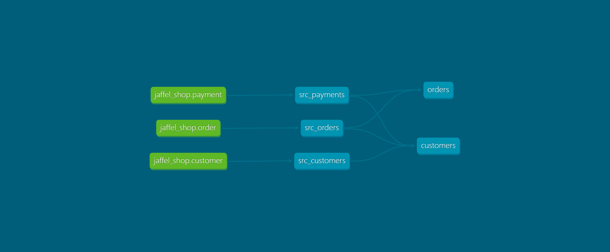

# dbt-jaffel-shop
DBT jaffel shop connected to snowflake database

The raw data consists of customers, orders, and payments, with the following entity-relationship diagram:




### Running this project
To get up and running with this project:
1. Install dbt using [these instructions](https://docs.getdbt.com/docs/installation).

2. Clone this repository.
3. Open `_resource` folder, and run **load_data.sql** and **user.sql** code in any cloud providers (I am using Snowflake data warehouse).

4. Change into the `jaffleshop` directory from the command line:
```bash
$ cd jaffle_shop
```

5. Set up a profile called `jaffleshop` to connect to a data warehouse by following [these instructions](https://docs.getdbt.com/docs/configure-your-profile). If you have access to a data warehouse, you can use those credentials – we recommend setting your [target schema](https://docs.getdbt.com/docs/configure-your-profile#section-populating-your-profile) to be a new schema (dbt will create the schema for you, as long as you have the right privileges). If you don't have access to an existing data warehouse, you can also setup a local postgres database and connect to it in your profile.

6. Ensure your profile is setup correctly from the command line:
```bash
$ dbt debug
```

7. Run the models:
```bash
$ dbt run
```

8. Test the output of the models:
```bash
$ dbt test
```

9. Generate documentation for the project:
```bash
$ dbt docs generate
```

10. View the documentation for the project:
```bash
$ dbt docs serve
```